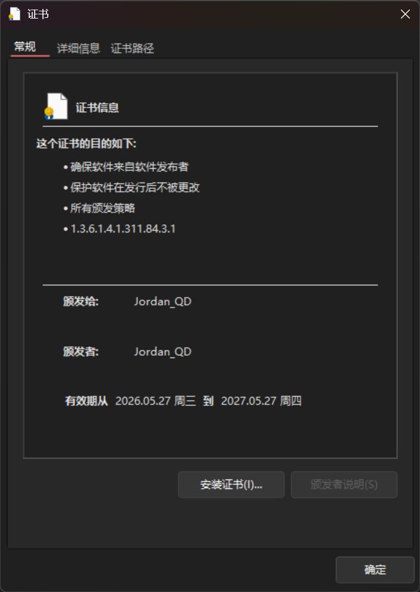
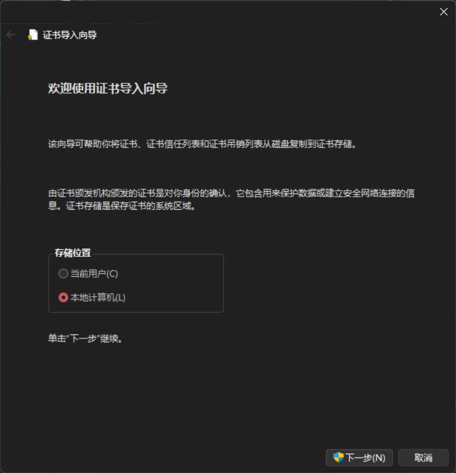
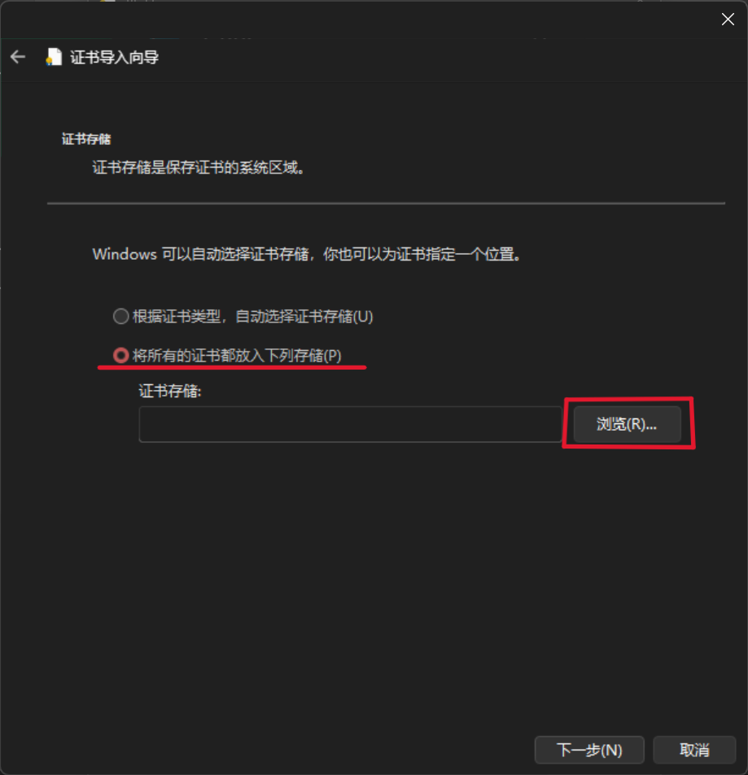
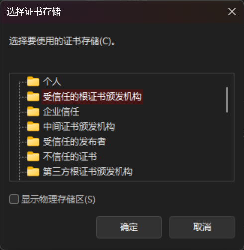
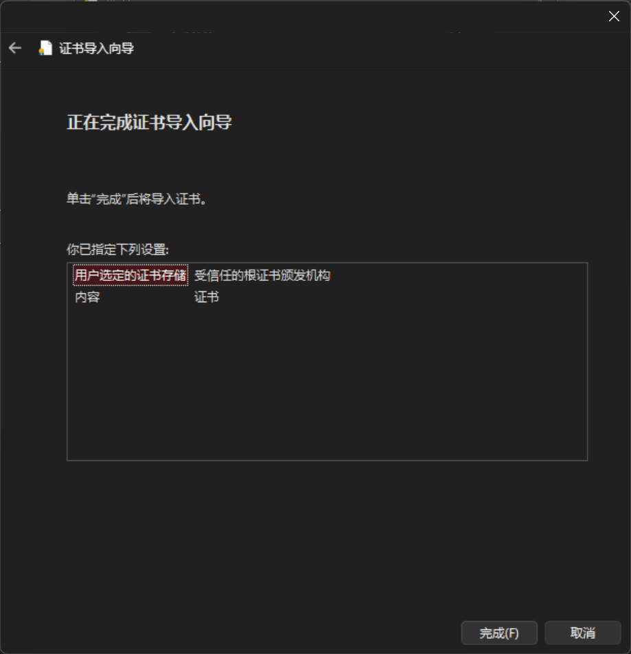
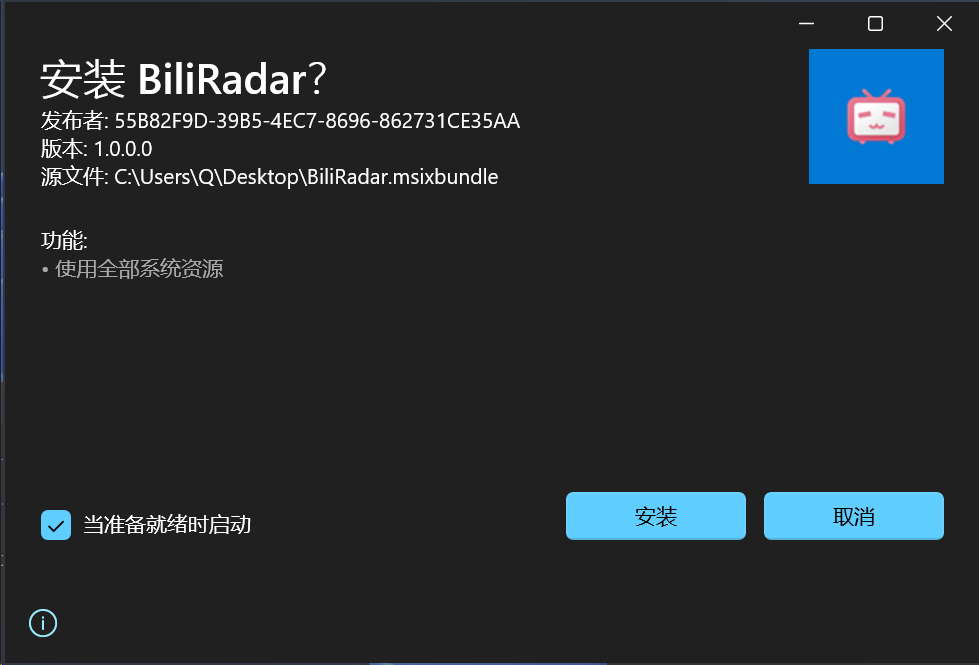

# 安装教程

从 [GitHub Releases](../../releases) 下载最新版本的 `BiliRadar.msixbundle` 和 `BiliRadar_Certificate.cer`。

## 第一步：安装证书（如果以前已经安装过，可以跳过此步）

> 此步骤需要管理员权限。证书用于签名 MSIX 包，使 Windows 信任该应用。

双击 `BiliRadar_Certificate.cer`，选择"安装证书" → "本地计算机" → "将所有证书放入下列存储" → 浏览 → "受信任的根证书颁发机构" → 完成。

1. 安装证书

    

2. 选择证书存储位置：本地计算机

    

3. 选择将证书放入"受信任的根证书颁发机构"

    
    

4. 完成安装

    

## 第二步：安装应用

双击 `.msixbundle` 文件，点击"安装"即可。Windows 会自动选择匹配你设备架构的版本。



或者使用 PowerShell 命令安装：

```powershell
Add-AppxPackage -Path "路径\BiliRadar.msixbundle"
```

## 更新

下载新版本直接双击安装，无需手动卸载旧版本。如果新版本证书与旧版本不同，需先导入新证书。
