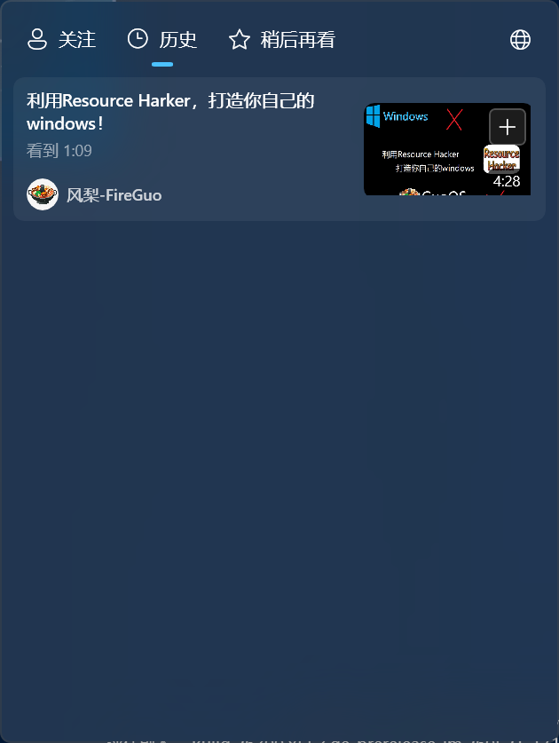
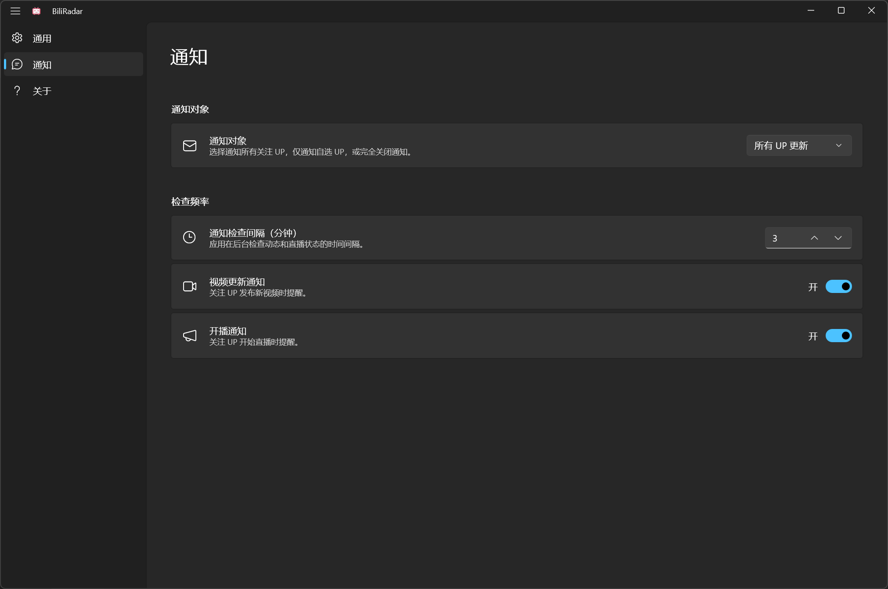
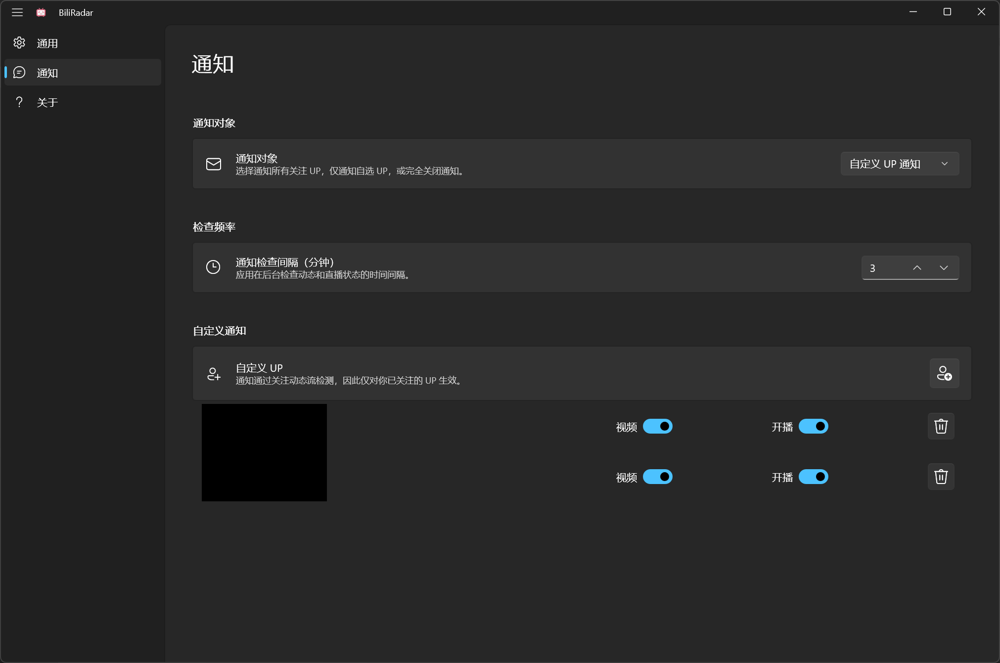

# BiliRadar

一个放在任务栏托盘里的 B 站动态雷达。  
用于查看关注 UP 的最新视频、直播状态、历史记录、稍后再看，并在后台提醒视频更新和开播。


> BiliRadar 不是哔哩哔哩官方应用，与哔哩哔哩没有从属、赞助或背书关系。

## 功能

- 关注动态：查看关注 UP 的最新视频。

- 直播状态：显示正在直播的 UP，可在设置中选择展开、折叠或隐藏。

    

- 历史记录：查看最近看过的视频。

    

- 稍后再看：查看稍后再看列表，并支持从应用内添加或移除。

    

- 开机自启：可选择登录 Windows 后自动运行。
- 配置导入导出：导出或恢复通知、启动、登录状态等配置。
- 托盘驻留：从任务栏托盘快速打开主界面或设置。
    

- 桌面通知：支持视频更新通知和开播通知，可只关注指定 UP 的视频更新或开播提醒。

    

    

## 截图

仓库目前还没有提交正式截图。建议补充以下图片，方便用户在 GitHub 和 Microsoft Store 页面快速了解应用：

- `docs/screenshots/main.png`：主界面，展示关注、正在直播和最新视频。
- `docs/screenshots/settings-general.png`：通用设置，展示登录、自启、默认页面等选项。
- `docs/screenshots/settings-notification.png`：通知设置，展示通知间隔和自定义 UP 通知。

添加截图后，可以把下面这段取消注释：

```md


```

## 使用说明

首次使用需要在设置中通过网页登录 Bilibili 账号。登录后，BiliRadar 会读取与你账号相关的关注动态、历史记录、稍后再看和直播状态。

BiliRadar 依赖 Bilibili 的网页登录和公开接口行为。如果 Bilibili 调整登录验证、接口返回或风控策略，部分功能可能需要更新后才能继续使用。

## 账号与隐私

登录状态保存在本机应用数据中，用于后续刷新动态。BiliRadar 不运营自己的账号系统，也不会把你的 Bilibili 数据发送到开发者服务器。网络请求由你的设备直接访问 Bilibili 服务或你主动打开的链接。

配置导出文件可能包含登录 Cookie 和其他本地设置，请不要随意分享导出的配置文件。

更完整的隐私说明见 [PRIVACY.md](PRIVACY.md)。

## 开发环境

- Windows 10 1809 或更高版本。
- Visual Studio 2022，建议安装“.NET 桌面开发”和 Windows 应用 SDK / WinUI 相关工作负载。
- .NET SDK 9 或更高版本。
- Windows App SDK 2.1.3。
- WebView2 Runtime。

项目使用：

- WinUI 3
- Windows App SDK
- CommunityToolkit.Mvvm
- CommunityToolkit.WinUI
- Microsoft.Web.WebView2

## 编译

还原依赖：

```powershell
dotnet restore BiliRadar.slnx
```

编译 x64：

```powershell
dotnet build BiliRadar.slnx -c Release -p:Platform=x64 --no-restore
```

编译 ARM64：

```powershell
dotnet build BiliRadar.slnx -c Release -p:Platform=ARM64 --no-restore
```

## 贡献

欢迎提交 Issue 或 Pull Request。

## 参考

