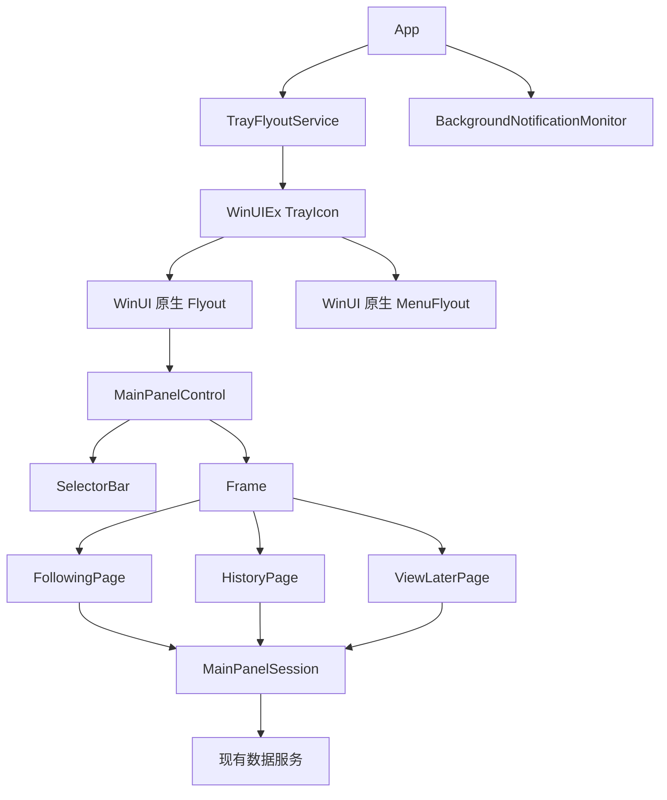

# BiliRadar 托盘主面板迁移设计：采用 WinUI 原生 Flyout

> 状态：实施基线
> 最近检查：2026-06-02
> 参考项目：`C:\Users\Q\Data\Visual Studio\FluentFlyouts`
> 目标：让托盘主面板获得系统一致的打开、关闭和 light-dismiss 动画，同时尽量使用现成依赖，不维护自制 Shell 托盘基础设施。

## 1. 结论

BiliRadar 的托盘主面板应从“显示和隐藏一个顶层 `MainWindow`”迁移为：

1. 使用 **WinUIEx 2.9.0** 提供的 `TrayIcon`、托盘菜单和 Flyout 挂载能力。
2. 使用 WinUI 3 原生 `Flyout` 作为主面板容器。
3. 将当前 `MainWindow` 中的业务 UI 抽取为可嵌入的 `MainPanelControl`，并在控件内部使用原生 `SelectorBar + Frame + Page` 组织三个同级视图。
4. 让 WinUI 原生 Flyout transition 负责打开、关闭动画，不再调用 `AnimateWindow`，也不对应用内根元素模拟窗口动画。
5. 删除或逐步退役 BiliRadar 自己维护的 `Shell_NotifyIcon`、WndProc 和托盘回调实现。

这条路线复用了 FluentFlyouts 的核心思路，但不照搬它的低层托盘代码。FluentFlyouts 创建于较早版本的 WinUIEx 生态中，因此仍然手动使用 TerraFX 调用 Win32 API；当前 WinUIEx 已经内置 WinUI 3 托盘 Flyout 和菜单支持。

## 2. 为什么 FluentFlyouts 的动画自然

FluentFlyouts 的托盘面板不是普通顶层窗口动画，也没有使用 `AnimateWindow`。它的实现可以概括为：

```text
托盘左键点击
  -> 激活一个透明、不可见的 WindowEx 锚点窗口
  -> 将锚点移动到鼠标附近
  -> 调用 WinUI 原生 Flyout.ShowAt(...)
  -> Flyout 使用系统内置 transition 出现
  -> 外部点击触发 light dismiss
  -> Flyout.Closed 隐藏锚点窗口
```

本地参考文件：

- `FluentFlyouts.Flyouts\TrayFlyoutWindow.xaml`
- `FluentFlyouts.Flyouts\TrayFlyoutWindow.xaml.cs`
- `FluentFlyouts.Flyouts\TrayIcon.cs`

参考项目的 Flyout 还设置了：

```xml
<Flyout
    LightDismissOverlayMode="On"
    ShouldConstrainToRootBounds="False">
    <Flyout.SystemBackdrop>
        <MicaBackdrop />
    </Flyout.SystemBackdrop>
</Flyout>
```

`LightDismissOverlayMode="On"` 使点击 Flyout 外部区域时自动关闭。托盘图标位于 Flyout 外部，所以再次点击托盘图标时，系统会先触发 light dismiss。参考项目并没有维护复杂的二次点击状态机。

## 3. BiliRadar 当前实现

BiliRadar 当前使用两套顶层窗口：

- `TrayHostWindow.cs`：隐藏宿主窗口，用于维持托盘应用生命周期。
- `MainWindow.xaml(.cs)`：420 像素宽的实际主面板窗口。

托盘功能位于：

- `Services\TrayIconService.cs`
- `SystemTray\Core\SystemTrayManager.cs`
- `SystemTray\Core\WindowHelper.cs`
- `SystemTray\UI\SystemTrayIcon.cs`

当前托盘图标由 BiliRadar 自己调用 `Shell_NotifyIcon` 创建，并通过自定义窗口消息分发左键和右键行为。左键最终进入 `App.ToggleMainWindow()`，根据 `_mainWindow?.IsVisible` 决定打开或关闭顶层窗口。

这套实现的主要问题不是功能不足，而是职责重叠：

- 自己维护 Shell 托盘图标和 WndProc。
- 自己管理主窗口定位、激活、失焦关闭和二次点击关闭。
- 自己处理窗口回收和异步加载收尾。
- 如果另加窗口动画，还要协调 Win32 窗口状态和 WinUI 内容状态。

迁移后，Shell 交互、Flyout 出现动画和 light dismiss 应交给 WinUIEx 与 WinUI 处理。BiliRadar 只保留业务数据加载和资源释放逻辑。

## 4. 依赖决策

### 4.1 推荐依赖

| 依赖 | 版本 | 用途 | 决策 |
| --- | --- | --- | --- |
| `WinUIEx` | `2.9.0` | WinUI 3 托盘图标、Flyout、托盘菜单和宿主窗口能力 | 添加 |
| `Microsoft.WindowsAppSDK` | 项目现有版本 | WinUI 3 与原生 `Flyout` | 保留 |

截至 2026-06-02，NuGet 上的 WinUIEx 最新版本为 `2.9.0`。该版本的发布说明明确包含 WinUI 3 托盘菜单和 Flyout 支持，并提供 `TrayIcon.Selected`、`TrayIcon.ContextMenu`、`TrayIcon.CloseFlyout()`、`TrayIconEventArgs.Flyout`、`TrayIconEventArgs.Handled` 和 `TrayIcon.ContainerWindow` 等 API。

实施时应先阅读 WinUIEx 仓库中的最新示例，再按当前 API 编写代码。不要从 FluentFlyouts 复制旧版托盘实现。

### 4.2 不建议添加的依赖

| 依赖 | 参考项目用途 | 本项目决策 |
| --- | --- | --- |
| `TerraFX.Interop.Windows` | 手动调用 Win32 API，创建托盘图标和透明宿主窗口 | 默认不添加。WinUIEx 已覆盖目标能力 |
| `FluentIcons.WinUI` | 图标资源 | 当前迁移不需要。只有 UI 设计明确使用时再添加 |
| `H.NotifyIcon.WinUI` | 另一套托盘图标库 | 作为备选，不作为本次首选 |

`H.NotifyIcon.WinUI` 功能完整，但截至 2026-06-02，其 NuGet 最新版本 `2.4.1` 的主要目标框架已前进到 .NET 10。BiliRadar 当前不应为了托盘动画顺带进行框架升级。

## 5. 目标架构



推荐新增：

- `Controls\MainPanelControl.xaml`
- `Controls\MainPanelControl.xaml.cs`
- `Pages\FollowingPage.xaml`
- `Pages\FollowingPage.xaml.cs`
- `Pages\HistoryPage.xaml`
- `Pages\HistoryPage.xaml.cs`
- `Pages\ViewLaterPage.xaml`
- `Pages\ViewLaterPage.xaml.cs`
- `Models\MainPanelSection.cs`
- `Services\MainPanelSession.cs`
- `Services\TrayFlyoutService.cs`

推荐修改：

- `BiliRadar.csproj`
- `App.xaml.cs`
- `App.xaml`
- `Controls\VideoCard.xaml`
- `Controls\VideoCard.xaml.cs`

完成迁移后可删除或退役：

- `MainWindow.xaml`
- `MainWindow.xaml.cs`
- `Services\TrayIconService.cs`
- `SystemTray\` 下自制托盘基础设施
- `TrayHostWindow.cs`，如果 WinUIEx 的 `TrayIcon.ContainerWindow` 已满足应用生命周期需求

`TrayHostWindow.cs` 是否删除，应在打包版和非打包版都完成验证后决定。不要在第一阶段直接移除。

## 6. 交互行为约定

迁移后的行为必须满足：

| 操作 | 预期行为 |
| --- | --- |
| 主面板关闭时左键点击托盘图标 | 打开 Flyout，并获得系统原生动画 |
| 主面板打开时再次左键点击托盘图标 | 关闭 Flyout，不重新打开 |
| 点击主面板以外区域 | light dismiss 自动关闭 Flyout |
| 右键点击托盘图标 | 打开原生 `MenuFlyout` |
| 点击菜单中的“打开” | 打开主面板 |
| 点击菜单中的“设置” | 打开设置入口 |
| 点击菜单中的“退出” | 停止后台监控并退出应用 |

不再让 `MainWindow.Activated` 和托盘 `WM_LBUTTONUP` 同时竞争关闭状态。Flyout 自己维护打开状态，WinUIEx 负责托盘事件桥接。

## 7. 实施步骤

### 阶段 0：保留当前可运行基线

在迁移开始前记录：

- 主面板打开、关闭和二次点击行为。
- 后台通知监控是否继续工作。
- 连续打开和关闭 10 次后的 working set 与 private memory。
- x64 Debug、x64 Release 和 MSIX 包安装后的托盘行为。

当前 `App.xaml.cs` 中用于处理二次点击竞态的延迟关闭补丁可以先保留，直到新的 Flyout 路径完全接管主面板。它是旧架构的过渡修复，不应成为新架构的一部分。

### 阶段 1：添加 WinUIEx 并做最小原型

添加 NuGet 依赖：

```xml
<PackageReference Include="WinUIEx" Version="2.9.0" />
```

先创建只包含一行文本的 Flyout 原型，验证：

- 托盘左键能打开 Flyout。
- 第二次左键能关闭 Flyout。
- 点击外部能 light dismiss。
- 右键菜单不与主 Flyout 冲突。
- 打包版与非打包版都能退出干净。

这一阶段不要搬迁业务 UI。先确认依赖的宿主窗口、Flyout 状态和托盘行为可靠。

### 阶段 2：抽取主面板内容

将 `MainWindow.xaml` 中属于业务面板的布局移动到 `MainPanelControl.xaml`。

拆分原则：

- 与窗口句柄、定位、激活、隐藏相关的逻辑不进入 `MainPanelControl`。
- 数据加载、刷新、卡片渲染、滚动区域和状态提示进入 `MainPanelControl`。
- 需要在关闭时停止的异步任务使用 `CancellationTokenSource` 或现有释放机制。
- 需要跨次打开保留的数据放在服务层，不依赖控件实例存活。

#### 2.1 先拆外壳，再拆页面

不要把当前 `MainWindow.xaml` 整体改名为 `MainPanelControl.xaml` 后就停止。当前文件同时包含：

- 面板级外壳：顶部进度条、`SelectorBar`、打开网页按钮和底部 `InfoBar`。
- 关注页：直播横向区域、最新视频标题、视频列表和滚动加载。
- 历史页：历史列表、空状态和滚动加载。
- 稍后再看页：列表、空状态和滚动加载。
- 顶层窗口行为：窗口句柄、定位、激活、隐藏、失焦关闭和任务栏可见性。

迁移时应把它们分成三层：

| 层级 | 新位置 | 保留内容 |
| --- | --- | --- |
| 托盘与 Flyout 宿主 | `TrayFlyoutService` | WinUIEx `TrayIcon`、原生 `Flyout`、原生 `MenuFlyout`、打开和关闭 |
| 主面板外壳 | `MainPanelControl` | 进度条、`SelectorBar`、网页按钮、`Frame`、状态通知 |
| 页面内容 | 三个 `Page` | 各自列表、空状态、滚动加载、页内交互 |

旧 `MainWindow.xaml.cs` 中的窗口句柄、`AppWindow`、`ShowWindowNative`、`SetWindowPos`、`SetForegroundWindow`、`HideFromTaskbar` 和失焦关闭逻辑不要进入 `MainPanelControl` 或三个 `Page`。它们只属于旧顶层窗口架构。

#### 2.2 使用原生 `Frame` 承载三个页面

`MainPanelControl.xaml` 中保留 `SelectorBar`，将当前三个并排存在、靠 `Visibility` 切换的区域替换为一个 `Frame`：

```xml
<SelectorBar
    x:Name="ContentSelectorBar"
    SelectionChanged="ContentSelectorBar_SelectionChanged">
    <SelectorBarItem
        x:Name="FollowingSelectorItem"
        x:Uid="MainFollowingSelectorItem"
        Icon="Contact"
        IsSelected="True"
        Text="关注" />
    <SelectorBarItem
        x:Name="HistorySelectorItem"
        x:Uid="MainHistorySelectorItem"
        Icon="Clock"
        Text="历史" />
    <SelectorBarItem
        x:Name="ViewLaterSelectorItem"
        x:Uid="MainViewLaterSelectorItem"
        Icon="Favorite"
        Text="稍后再看" />
</SelectorBar>

<Frame
    x:Name="ContentFrame"
    Grid.Row="2"
    CacheSize="3"
    IsNavigationStackEnabled="False" />
```

这里使用 `IsNavigationStackEnabled="False"` 是有意为之。三个 `SelectorBarItem` 是平级数据视图，不是“详情页进入后可以返回”的层级导航。不要为它们维护返回栈，也不要新增自制导航历史。

`Frame` 只能导航到继承自 `Page` 的类型，因此页面应新建为：

- `FollowingPage : Page`
- `HistoryPage : Page`
- `ViewLaterPage : Page`

不要把三个视图继续做成 `UserControl` 后塞入 `ContentPresenter`，也不要维护一个自制控件缓存字典。`Frame` 已经提供页面创建、导航事件和页面缓存能力。

#### 2.3 使用 Gallery 同款原生页面过渡

当前 `MainWindow.xaml.cs` 中的 `ShowSelectedPage(...)`、`GetSelectedPage(...)` 和 `AnimateSelectedPage(...)` 是旧结构下的过渡实现。迁移为 `Frame` 后应删除这组页面切换逻辑，并使用 WinUI Gallery `SelectorBar` 示例中的原生 `SlideNavigationTransitionInfo`：

```csharp
using Microsoft.UI.Xaml.Controls;
using Microsoft.UI.Xaml.Media.Animation;

private int _previousSelectedPageIndex;

private void ContentSelectorBar_SelectionChanged(
    SelectorBar sender,
    SelectorBarSelectionChangedEventArgs args)
{
    var currentSelectedPageIndex = sender.Items.IndexOf(sender.SelectedItem);
    var pageType = currentSelectedPageIndex switch
    {
        0 => typeof(FollowingPage),
        1 => typeof(HistoryPage),
        _ => typeof(ViewLaterPage),
    };

    var effect = currentSelectedPageIndex > _previousSelectedPageIndex
        ? SlideNavigationTransitionEffect.FromRight
        : SlideNavigationTransitionEffect.FromLeft;

    ContentFrame.Navigate(
        pageType,
        null,
        new SlideNavigationTransitionInfo { Effect = effect });

    _previousSelectedPageIndex = currentSelectedPageIndex;
}
```

这是 WinUI 官方为 `SelectorBar` 展示的做法。不要再为三个页面的切换调用 Toolkit `AnimationBuilder`、`Storyboard` 或 Composition API。`CommunityToolkit.WinUI.Animations` 仍可保留给直播区域折叠、`InfoBar` 出入等局部效果，但不再负责页面导航。

第一次创建 `MainPanelControl` 时，应显式导航到默认页。不要依赖键盘焦点首次进入 `SelectorBar` 后才自动选择第一项：

```csharp
public MainPanelControl()
{
    InitializeComponent();
    ContentSelectorBar.SelectedItem = FollowingSelectorItem;
}
```

如果默认页来自 `AppSettings.DefaultOpenPage`，则将设置映射为 `MainPanelSection`，再设置对应的 `SelectorBarItem`。保持一个映射入口，不要让托盘服务、页面和按钮分别维护自己的索引判断。

#### 2.4 使用 Frame 页面缓存保留切换状态

默认情况下，`Frame.Navigate(...)` 会创建新的页面实例。三个页面会被频繁来回切换，并且应保留各自滚动位置、已经加载的列表和空状态，因此建议每个页面声明：

```xml
<Page
    x:Class="BiliRadar.Pages.FollowingPage"
    ...
    NavigationCacheMode="Required">
```

`HistoryPage` 和 `ViewLaterPage` 同样设置 `NavigationCacheMode="Required"`。`MainPanelControl` 的 `Frame.CacheSize="3"` 保持页面数量意图清晰；`Required` 确保三个页面在当前面板会话中都被复用。

页面缓存只负责一次 `MainPanelControl` 会话内的视图复用。Flyout 关闭后是否继续保留整个 `MainPanelControl`，仍按第 8 节的内存测量结果决定。不要为了跨 Flyout 会话保留状态而把 `Page` 存入应用级静态字段。

#### 2.5 添加轻量的页面会话，不要添加自制导航框架

三个页面需要共享现有数据服务、集合和加载状态，但 `Frame.Navigate(...)` 不适合传递一个大型业务对象。`Frame` 会持有导航参数；官方建议尽量传递简单标识符，避免导航状态序列化和对象引用保留问题。

推荐新增一个由 `MainPanelControl` 持有的 `MainPanelSession`：

```text
MainPanelControl
  -> 创建 MainPanelSession
  -> Frame 导航到 Page
  -> 在 Frame.Navigated 中把 Session 交给当前页面
  -> Flyout 会话结束时 Dispose Session
```

使用一个小接口即可，不要引入自制路由器、页面工厂或服务定位器：

```csharp
internal interface IMainPanelPage
{
    void Initialize(MainPanelSession session);
}

private void ContentFrame_Navigated(object sender, NavigationEventArgs args)
{
    if (args.Content is IMainPanelPage page)
    {
        page.Initialize(_session);
    }
}
```

`Initialize(...)` 必须幂等，因为缓存页面再次显示时仍可能收到导航事件。页面级刷新应单独提供 `ActivateAsync()` 或等价方法，并由 `MainPanelControl` 在选中页面后触发。不要让页面构造器直接发起网络请求。

`MainPanelSession` 建议承接：

- `_updateMonitorService`
- `Updates`
- `HistoryItems`
- `ViewLaterItems`
- `Following`
- `LiveCreators`
- `_loadedUpdateIds`
- `_loadedHistoryIds`
- `_loadedViewLaterIds`
- 各页 `IsLoading`、`HasMore` 和取消令牌
- `MainWindowSnapshot` 的创建与恢复
- 需要共享的关注、稍后再看、清理登录状态等业务操作

`MainPanelControl` 建议保留：

- `SelectorBar` 和 `Frame`
- 顶部刷新进度聚合
- 底部 `StatusNotifications`
- 根据 `MainPanelSection` 打开对应 Bilibili 网页
- Flyout 会话打开、关闭时调用 Session 的入口

每个 `Page` 建议只保留：

- 自己的 XAML 和视觉状态
- 自己的 `ScrollViewer` 或列表
- 自己的滚动加载触发
- 将用户操作转发给 Session

#### 2.6 三个页面的搬迁清单

| 旧位置 | 新位置 | 说明 |
| --- | --- | --- |
| `VideoScrollViewer`、`FollowingPagePanel`、`LiveCreatorsSection`、`LiveCardsScrollViewer`、`LatestVideosHeader`、`VideoCardsPanel` | `FollowingPage.xaml` | 关注页完整迁移 |
| `VideoScrollViewer_ViewChanged`、`LoadMoreUpdatesAsync()`、直播区域展开收起 | `FollowingPage.xaml.cs` 和 `MainPanelSession` | 页面负责滚动触发，Session 负责数据加载 |
| `HistoryPagePanel`、`HistoryScrollViewer`、`HistoryCardsPanel`、`HistoryEmptyPanel` | `HistoryPage.xaml` | 历史页完整迁移 |
| `HistoryScrollViewer_ViewChanged`、`LoadMoreHistoryAsync()` | `HistoryPage.xaml.cs` 和 `MainPanelSession` | 页面负责滚动触发，Session 负责数据加载 |
| `ViewLaterPagePanel`、`ViewLaterScrollViewer`、`ViewLaterCardsPanel`、`ViewLaterEmptyPanel` | `ViewLaterPage.xaml` | 稍后再看页完整迁移 |
| `ViewLaterScrollViewer_ViewChanged`、`LoadMoreViewLaterAsync()` | `ViewLaterPage.xaml.cs` 和 `MainPanelSession` | 页面负责滚动触发，Session 负责数据加载 |
| `ContentSelectorBar`、`OpenBrowserButton`、`StatusItemsControl`、顶部 `ProgressBar` | `MainPanelControl.xaml` | 保持为面板级公共 UI |
| `ShowSelectedPage(...)`、`GetSelectedPage(...)`、`AnimateSelectedPage(...)` | 删除 | 改由原生 `Frame.Navigate(...)` 过渡处理 |
| `CreateSnapshot()`、`InitializeFirstFrame(...)` | `MainPanelSession` | 从窗口生命周期迁移到面板会话生命周期 |
| `AdjustWindowSizeToContent()` | 删除或改为 Flyout 内容尺寸约束 | Flyout 迁移后不再移动顶层面板窗口 |

#### 2.7 性能优化是独立阶段：优先替换纵向 StackPanel

改成 `Frame + Page` 的主要收益是职责拆分、原生导航语义和原生页面过渡。它不会自动优化列表性能。

当前三个视频列表使用：

```text
ScrollViewer
  -> StackPanel
     -> VideoCard
     -> VideoCard
     -> ...
```

并通过 `Panel.Children.Add(...)`、`Insert(...)`、`RemoveAt(...)` 和 `Clear()` 手动维护。随着列表增长，所有卡片都会留在视觉树中。后续性能优化应优先迁移为原生数据绑定列表：

```xml
<ListView
    ItemsSource="{x:Bind Session.Updates, Mode=OneWay}"
    SelectionMode="None">
    <ListView.ItemTemplate>
        <DataTemplate x:DataType="models:VideoUpdateRow">
            <controls:VideoCard
                Item="{x:Bind}"
                CoverTapped="VideoCard_CoverTapped"
                CreatorAvatarClicked="VideoCard_CreatorAvatarClicked"
                ViewLaterClicked="VideoCard_ViewLaterClicked" />
        </DataTemplate>
    </ListView.ItemTemplate>
</ListView>
```

三个纵向视频列表优先使用 `ListView`，因为它提供滚动、容器复用、键盘行为和虚拟化策略。不要在 `ListView` 外再套一个纵向 `ScrollViewer`，否则会破坏虚拟化和滚动所有权。

关注页应改为：

```text
Grid
  Row Auto -> 直播区域
  Row Auto -> “最新视频”标题
  Row *    -> ListView
```

历史页和稍后再看页应改为：

```text
Grid
  -> ListView
  -> 居中的空状态 StackPanel，按集合数量显示或隐藏
```

`VideoCard` 已经是 `UserControl`，可以继续作为 `DataTemplate` 内容，但需要逐步清理：

- 保留 `Item`、`ViewLaterButtonMode`、`ShowMetaTime` 等配置入口。
- 让 `Loaded` 初始化幂等。当前 `OnLoaded(...)` 每次都会调用 `BuildTextPanel()` 并订阅 `ActualThemeChanged`；虚拟化后控件可能卸载、重载和复用，不能重复创建文本树或重复订阅事件。
- 增加与复用兼容的轻量清理路径：控件暂时离开可视区域时清理当前图片引用和与当前条目相关的临时状态，但不要把可复用控件直接永久 `Dispose()`。
- 保留 `Dispose()` 给 Session 结束或控件永久释放时使用，并确保释放图片引用、上下文菜单和事件订阅。
- 为图片异步加载增加条目版本或取消令牌校验。`VideoCard.Item` 被改成新条目后，旧条目的封面和头像请求不能再写回当前控件。
- 将只用于手动 `Panel.Children` 维护的 `RenderVideoCards()`、`RenderHistoryCards()`、`RenderViewLaterCards()`、`ReplaceHistoryCard(...)` 和 `DiffRefreshPanel(...)` 逐步删除。
- 让 `ObservableCollection<T>` 变更直接驱动 UI，不再同步维护“集合 + Panel.Children”两套状态。

先使用 `ListView` 的默认虚拟化行为。只有性能测量确认卡片创建或图片加载仍然造成明显卡顿时，再考虑 `ContainerContentChanging` 等渐进式渲染钩子。不要在第一版迁移中同时引入复杂的容器回收状态机。

直播横向区域可以后续单独迁移为：

```xml
<ScrollViewer
    HorizontalScrollMode="Enabled"
    HorizontalScrollBarVisibility="Auto"
    VerticalScrollMode="Disabled"
    VerticalScrollBarVisibility="Disabled">
    <ItemsRepeater ItemsSource="{x:Bind Session.LiveCreators, Mode=OneWay}">
        <ItemsRepeater.Layout>
            <StackLayout Orientation="Horizontal" Spacing="6" />
        </ItemsRepeater.Layout>
    </ItemsRepeater>
</ScrollViewer>
```

`ItemsRepeater` 是低策略、支持虚拟化的原生布局构件，没有内置滚动、选择或键盘策略，因此横向直播条目适合使用它；三个主要纵向视频列表则优先使用更完整的 `ListView`。不要为了统一控件而把所有列表都强行改成 `ItemsRepeater`。

#### 2.8 推荐实施顺序

不要在一个提交中同时改完 Flyout、Frame、Session 和虚拟化。建议拆成可验证的小步：

1. 新建 `MainPanelControl`，先原样承接旧业务 UI，验证 Flyout 生命周期。
2. 新建三个 `Page` 和一个 `Frame`，使用原生 `SlideNavigationTransitionInfo`，保留现有手动卡片面板。
3. 将共享集合、服务、快照和请求状态抽取到 `MainPanelSession`。
4. 将历史页和稍后再看页的纵向列表先改为绑定 `ListView`。
5. 将关注页的视频列表改为绑定 `ListView`，保留直播横向区域。
6. 测量后再决定是否将直播区域改为 `ItemsRepeater`。
7. 删除不再使用的手动渲染方法、页面切换 Toolkit 动画和旧顶层窗口代码。

每一步都应单独完成 x64 Debug 构建、托盘打开关闭、三页切换、滚动加载和内存观察，再进入下一步。

### 阶段 3：将主面板接入原生 Flyout

下面代码只表达结构。实施时应以 WinUIEx `2.9.0` 仓库中的示例为准，确认构造器和事件参数的准确写法：

```csharp
private readonly Flyout _mainFlyout = new()
{
    LightDismissOverlayMode = LightDismissOverlayMode.On,
    ShouldConstrainToRootBounds = false,
};

private void OnTrayIconSelected(object? sender, TrayIconEventArgs args)
{
    if (_mainFlyout.IsOpen)
    {
        _trayIcon.CloseFlyout();
        args.Handled = true;
        return;
    }

    args.Flyout = _mainFlyout;
}
```

Flyout 内容使用 `MainPanelControl`。视觉样式参考 FluentFlyouts：

- 使用 `MicaBackdrop` 或当前视觉方案允许的 backdrop。
- 保持圆角。
- 保持默认阴影。
- 不添加额外 slide 或 scale 动画。

### 阶段 4：迁移右键菜单

将当前自定义右键菜单改为 WinUIEx `TrayIcon.ContextMenu` 使用的 WinUI 原生 `MenuFlyout`。

至少保留：

- 打开主面板
- 设置
- 退出

托盘图标主题切换逻辑可以先保留，再迁移到 `TrayFlyoutService`。

### 阶段 5：清理旧托盘代码

确认以下测试通过后，再删除旧实现：

- 自制 `Shell_NotifyIcon` 封装
- 自制 WndProc 子类化
- 顶层 `MainWindow` 的激活和失焦关闭逻辑
- `AnimateWindow` 或应用内根元素窗口模拟动画
- 旧架构专用的延迟关闭补丁

## 8. 生命周期与内存策略

当前 BiliRadar 已经对关闭后的资源回收做过专门优化。迁移为 Flyout 后，不应默认让所有控件永远常驻，也不应在每次 light dismiss 后无条件强制 GC。

建议提供明确的面板会话：

```text
Flyout 打开
  -> 创建或恢复 MainPanelControl 会话
  -> 加载当前快照

Flyout 关闭
  -> 取消仍在运行的 UI 请求
  -> 释放卡片图片和 UI 引用
  -> 按测量结果决定保留控件还是重建控件
```

后台通知监控继续保持应用级生命周期，不绑定 Flyout 是否打开。

`Frame` 页面缓存与 Flyout 生命周期需要分开理解：

- `Page.NavigationCacheMode="Required"`：保留当前 `MainPanelControl` 会话内三个页面的 UI 状态。
- `MainPanelSession`：保留一次面板会话内的数据、请求状态和快照。
- `BackgroundNotificationMonitor`：保持应用级生命周期，不随 Flyout 开关重建。
- Flyout 关闭后是否保留 `MainPanelControl`：以测量结果决定，不由 `Frame` 自动决定。

最终策略以测量为准：

- 关注 working set。
- 同时记录 private memory。
- 测量首次打开耗时。
- 测量连续打开和关闭后的稳定内存。

## 9. 风险与验证矩阵

### 功能验证

- 左键打开、第二次左键关闭。
- 点击外部关闭。
- 右键菜单打开时，主 Flyout 状态正确。
- 设置入口和退出入口可用。
- 通知激活后行为正确。
- 应用退出后托盘图标不会残留。

### 显示验证

- 任务栏位于屏幕底部、顶部、左侧和右侧。
- 托盘图标显示在任务栏和溢出区域。
- 单屏和多屏。
- 100%、125%、150% 和 200% DPI。
- 浅色、深色和高对比度。
- 内容高度超过可用屏幕高度时仍可滚动。

### 构建与发布验证

- x64 Debug。
- x64 Release。
- ARM64 Release。
- 非打包启动。
- MSIX 安装后的启动、升级安装和退出。

## 10. 回滚策略

迁移期间保留旧 `TrayIconService`，通过一个临时配置或编译常量选择新旧路径：

```text
Legacy tray window path
WinUIEx tray flyout path
```

完成行为、内存和打包验证后删除旧路径。不要长期保留两套托盘实现。

## 11. 来源

### 本地参考项目

- `C:\Users\Q\Data\Visual Studio\FluentFlyouts`
- GitHub：[FireCubeStudios/FluentFlyouts](https://github.com/FireCubeStudios/FluentFlyouts)
- 许可证：MIT

### 推荐依赖

- NuGet：[WinUIEx 2.9.0](https://www.nuget.org/packages/WinUIEx/)
- 文档：[WinUIEx Documentation](https://dotmorten.github.io/WinUIEx/)
- GitHub：[dotMorten/WinUIEx](https://github.com/dotMorten/WinUIEx)

### Microsoft 官方文档

- [Flyout class](https://learn.microsoft.com/en-us/windows/windows-app-sdk/api/winrt/microsoft.ui.xaml.controls.flyout?view=windows-app-sdk-1.8)
- [Flyouts overview](https://learn.microsoft.com/windows/apps/design/controls/dialogs-and-flyouts/flyouts)
- [FlyoutBase.ShowAt](https://learn.microsoft.com/en-us/windows/windows-app-sdk/api/winrt/microsoft.ui.xaml.controls.primitives.flyoutbase.showat?view=windows-app-sdk-1.8)
- [FlyoutBase.ShouldConstrainToRootBounds](https://learn.microsoft.com/en-us/windows/windows-app-sdk/api/winrt/microsoft.ui.xaml.controls.primitives.flyoutbase.shouldconstraintorootbounds?view=windows-app-sdk-1.8)
- [SelectorBar](https://learn.microsoft.com/windows/apps/develop/ui/controls/selector-bar)
- [Frame.Navigate](https://learn.microsoft.com/en-us/windows/windows-app-sdk/api/winrt/microsoft.ui.xaml.controls.frame.navigate?view=windows-app-sdk-1.8)
- [Frame class](https://learn.microsoft.com/en-us/windows/windows-app-sdk/api/winrt/microsoft.ui.xaml.controls.frame?view=windows-app-sdk-1.8)
- [ItemsRepeater](https://learn.microsoft.com/windows/apps/develop/ui/controls/items-repeater)

### 备选依赖

- NuGet：[H.NotifyIcon.WinUI](https://www.nuget.org/packages/H.NotifyIcon.WinUI/)
- GitHub：[HavenDV/H.NotifyIcon](https://github.com/HavenDV/H.NotifyIcon)
